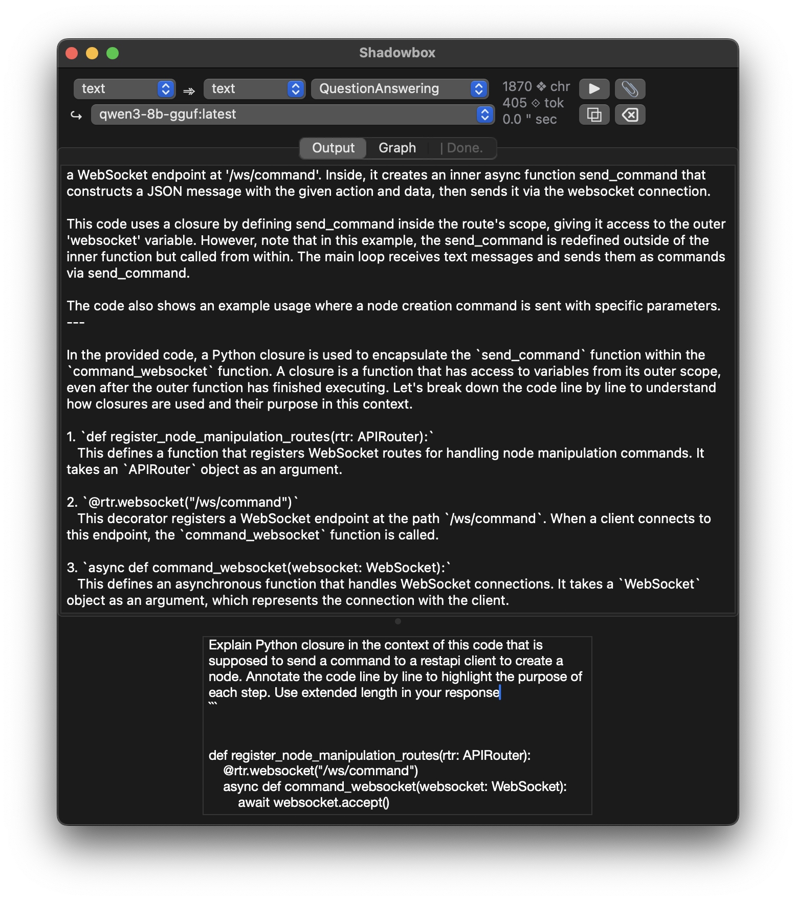

<picture>
  <source media="(prefers-color-scheme: dark)" srcset="img_src/zodiac_dark_stealth.png">
  <source media="(prefers-color-scheme: light)" srcset="img_src/zodiac_light_stealth.png">
  
</picture>  

# zodiac  self-assembling workflow automator

### [ [Windows](https://github.com/darkshapes/sdbx/wiki/Develop) | [MacOS](https://github.com/darkshapes/sdbx/wiki/Develop) | [Linux](https://github.com/darkshapes/sdbx/wiki/Develop) ]

 

 

Zodiac is a creative research platform for Generative AI. Guided by text, audio, or files, it identifies your models (text, image, speech, video, anything) and constructs generative AI workflows, eliminating the need for technical expertise in building action chains. It empowers users to focus on creating art, storytelling, research, and tool development, rather than the mechanics of creation, enabling exploration of emerging technology on virtually any system immediately, rather than after months of study.

> [!NOTE]
> Zodiac runs **locally** and **only** on your devices. Outside connections are not opened. Read the code & see for yourself.

* Sequence an infinite variety of generative workflows with ease
* No programming necessary
* Minimal, lightweight and versatile: Designed for smartphone, CLI terminal and browser use
* Local-first, privacy-oriented isolation: no data siphoning, remote telemetry or analytics
* Compatible with legacy consumer computer/CPU/TPU/GPU devices,
* Bring your own models - Supports [Ollama](https://ollama.com/), [Llamafile](http://github.com/Mozilla-Ocho/llamafile), [Cortex/Jan](http://cortex.so), [VLLM](https://github.com/vllm-project/vllm), [LMStudio](http://lmstudio.ai/), [HuggingFace](https://huggingface.co/)
* Support expanding to include: , CivitAI, ModelScope & AIO (all-in-one) local caches through [sdbx](https://github.com/darkshapes/sdbx).  

  
 
 
 
 
 

Supported models: 450

### [installation instructions link](https://github.com/darkshapes/sdbx/wiki/Develop) 

