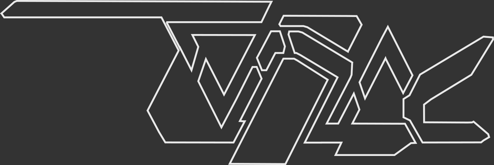

<picture>
  <source media="(prefers-color-scheme: dark)" srcset="img_src/zodiac_dark_stealth.png">
  <source media="(prefers-color-scheme: light)" srcset="img_src/zodiac_light_stealth.png">
  
</picture>

# Zodiac

### Multimodal generative media sequencer

Zodiac is a creative tool for DIY Generative AI. Guided by text, audio, or copied/pasted files, Zodiac easily chains sophisticated model systems together so that you can concentrate on making the art you want to make, the story you want to tell, and the tools you want to build, rather than build the tool to start making.

> [!NOTE]
> Zodiac runs **locally** and **only** on your device. Outside connections are not opened. Read the code & see for yourself.

We currently support popular repositories like Ollama and LMStudio, VLLM, and will support models from HuggingFace, CivitAI, and ModelScope, and standards like llamafile and MLX through [sdbx](https://github.com/darkshapes/sdbx).

More details forthcoming.
### Why

Every day brings a new development in the ML field, and with it the amount of knowledge required for new methods and models grows more and more, creating a drastic knowledge gap between the known and the novel thats impossible possible to bridge through normal means. Zodiac generates sophisticated workflows on its own for the benefit of everyone, allowing the intrepid and curious to engage and explore this new technology, while also fast-tracking enthusiast and researcher experimentation and building through our endless quest for optimizations, breakthrough techniques, and by extension knowledge of our abilities, minds and ourselves as humans.


<br>
<br>
<br><br>

## Installing

To install Zodiac you can use [`uv`](https://github.com/astral-sh/uv#installation):

```
uv pip install git+https://github.com/darkshapes/zodiac
```
or
<details ><summary>pip </summary>

> **1** : clone repo
>
> ```
> git clone https://github.com/darkshapes/zodiac.git
> ```

> **2** : Make a virtual environment
> ```
> python -m venv .venv
> ```

> **3** : Activate environment
> <details ><summary>Windows</summary>
>
> **(powershell):**
> ```
> Set-ExecutionPolicy Bypass -Scope Process -Force; .venv\Scripts\Activate.ps1
>
> ```
>
> **(cmd):**
> ```
> .venv\Scripts\activate.bat
> ```
>
> </details><br>
>
> <details ><summary>Linux/MacOS</summary>
>
> ```
> source .venv/bin/activate
> ```
>
>  </details>
<br>

> **4** : Install
> ```
> pip install zodiac
> ```

</details><br>


Once installed, the terminal client can be launched with its command:
```
zodiac
```

Or, you can run the client in a local browser:
```
textual serve zodiac
```

> [!TIP]
> You can also try Zodiac from command line without any installation using [`uv`](https://github.com/astral-sh/uv#installation):
> ```
> uvx --from git+https://github.com/darkshapes/zodiac zodiac
> ```

Be aware that even though Zodiac is local first, your huggingface/ollama/vllm/etc service may not be set up this way. Zodiac changes Python options, but you can also set flags to ensure that you are only using cached data:

> <details ><summary>Linux/MacOS</summary>

> ```
> export HF_HUB_DISABLE_TELEMETRY=1
> export export HF_HUB_OFFLINE=1
> ```
>  </details>

> <details ><summary>Windows</summary>
>
> ```
> set HF_HUB_DISABLE_TELEMETRY=1
> set export HF_HUB_OFFLINE=1
> ```
>  </details>

## Using

> [!IMPORTANT]
> Please note Zodiac is in a very incomplete demonstration state. Generating from speech recording, image generation, and full support for clipboard copying are not yet implemented, only the process of evaluating paths for models and pasting in and out of console. Please check in with us as we continue to grow, or read about <A href="#contributing">contributing</a>.


To use Zodiac, simply write into the text field, then choose your input and output forms. Moving out of the text field and tapping **\`** (grave accent) will send your message along. To clear the log or any received input, hold shift and tap `backspace`. If you want to pick specific models, the box on the right will show you all the models available that can take you from your input to your output type.

### Keyboard Reference:
```
        Tab          : Switch Focus
Up/Down Arrow        : Change option
        Enter        : Begin recording audio
        Space        : Playback audio
        Ctrl-Z       : Undo
        Ctrl-Shift-Z : Redo
        ALT-Backspace: Clear input
        ESC          : Cancel Generation
        ESC/Ctrl-Qx2 : Quit
        Ctrl-C       : Copy (only in console mode)
        Ctrl-V/⌘-V   : Paste (only in console mode)
        Ctrl-X       : Cut (only in console mode)
```

## Contributing

### Technical Details

Currently we support models hosted using:
- [Ollama](https://ollama.com/)
- [Cortex](http://cortex.so)
- [Llamafile](http://github.com/Mozilla-Ocho/llamafile)
- [LMStudio](http://lmstudio.ai/)

Also considering adding support for:
[TensorBlock](https://github.com/TensorBlock/TensorBlock-Studio) (Read<A href="#contributing">contributing</a>)
[VLLM](https://github.com/vllm-project/vllm) (Compile-only for cpu, read <A href="#contributing">contributing</a>)

If you have a strong preference, talk to us in issues or on <A href="discord.gg/RYaJw9mPPe">Discord</a>

Zodiac works by graphing available local model services, then pathing a route through the graph to complete the user request. The system relies heavily on the [Textual](https://github.com/Textualize/textual), [LiteLLM](https://github.com/BerriAI/litellm), [dspy](https://github.com/stanfordnlp/dspy), and [networkx](https://github.com/networkx/networkx) libraries.

Our software goals look like this:

- Model recognition using <a href="https://github.com/darkshapes/nnll">nnll</a>
- Support for STS/TTS/Image/Video/LoRA models and MLX from Huggingface/CivitAI/ModelScope <a href="https://github.com/darkshapes/sdbx">sdbx</a>
- Advanced no-code node-graph workflow modification using <a href="https://github.com/darkshapes/singularity">Singularity</a>

Discussion topics, issue requests, reviews, and code updates are all welcome and encouraged. We have a lot of plans so feel free to talk to us in our <A href="discord.gg/RYaJw9mPPe">Discord</a> to catch up-to-date information.

### Development Reference
```
*  Environment   : uv
   Telemetry     : False
HFHub Cache Only : True
*  Logging       : structlog (viztrace on crashes) to `/log` folder
*  Testing       : pytest -vv tests
*  Formatting    : ruff/better align
*  Linting       : ruff/pylint
*  Type Checking : pylance/pyright
*  Spelling      : typos vsc
*  Docstrings    : sphinx
*  CLI Commands  :

zodiac  [-h] [-n] [-t]            = Run Zodiac in the current terminal window
  -h, --help   show this help message and exit
  -n, --net    Allow network access (for downloading requirements)
  -t, --trace  Enable full tracelogging
textual     console [-x EVENTS]  = Run a live console logging session (use before textual --devzodiac/textual serve --dev)
textual     serve [--dev] zodiac = Host a localmachine server (shows CSS edits live, Python edits on refresh)
textual     run --dev zodiac     = Run an instance in command prompt using dev options (shows CSS edits live, relaunch for Python edits)
```

## Connecting

<div align='center'>

<br>
 d a r k s h a p e s<br><br>

### [ <A href="discord.gg/RYaJw9mPPe">Discord</a> ] [ <A href="https://github.com/darkshapes">GitHub</a> ] [ <A href="https://huggingface.co/darkshapes">HuggingFace</a> ] [ <A href="https://github.com/maxtretikov">MaxTretikov</a> ] [ <A href="https://github.com/exdysa">EXDYSA</a> ]
</div>


